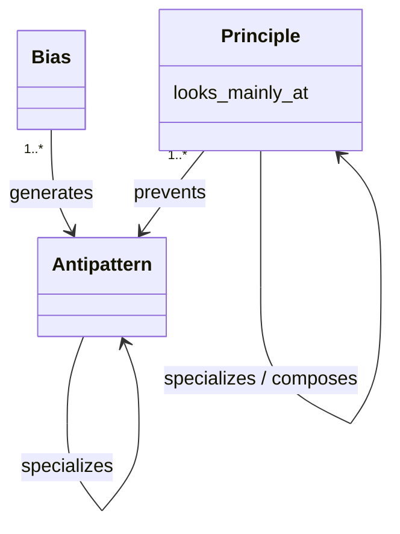

# Metamodel

This document defines what the model in `model.yaml` can contain.

## Nodes

### Bias

A bias is a default of LLM-generated output that generates antipatterns.

### Antipattern

An antipattern is a named failure that a bias generates.

The model excludes the following:

- Failures that have no name, which are described in the prose of the principle that prevents them.
- Failures from overapplying a principle, which are described in the prose of that principle.

Antipatterns do not partition failures. Each names what it takes as the problem, and one case can fall under several. Comparing an antipattern with its neighbors serves to make that problem clear, not to draw a boundary.

### Principle

A principle is a norm that counters the biases. It need not prevent an antipattern directly.

## Attributes

**looks_mainly_at**: the place where the principle's judgment starts, among the places that hold its material.

- `within`: the unit being written.
- `above`: what determines the unit, meaning the place that holds it and the grounds for judgments about it, such as an assumption or an established rule.
- `beside`: its siblings, and what already exists.
- `outside`: the reader's position, meaning what the reader can see and already knows.

A judgment can also use material from the other places.

## Relations

A `generates` or `prevents` edge holds for the antipattern as a whole, or for one of the alternative causes that the antipattern's definition lists.

**generates**: the edges are ordered, and the first bias is the primary source. Two tests decide which bias qualifies. First, countering the bias has to prevent the failure. Second, where the edge claims that the working context causes the failure, the failure must not recur after that context is cleared.

**prevents**: a principle prevents an antipattern when the antipattern is a failure to do what the principle asks. The edges are ordered, and the first principle is the primary remedy.

**specializes**: the specific node covers a subset of the cases that the general node covers.

**composes**: a principle combines the listed principles.
