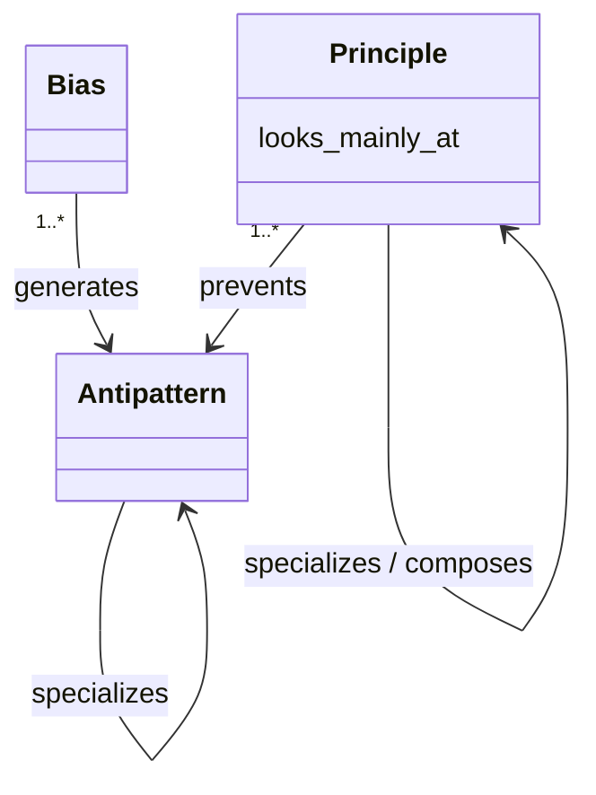

# Metamodel

This document defines what the model in `model.yaml` can contain.

```mermaid
classDiagram

class Bias
class Antipattern
class Principle {
  looks_mainly_at
}
Bias "1..*" --> Antipattern : generates
Principle "1..*" --> Antipattern : prevents
Antipattern --> Antipattern : specializes
Principle --> Principle : specializes / composes
```

## Nodes

### Bias

A bias is a default of LLM-generated output that generates antipatterns.

### Antipattern

An antipattern is a named failure that a bias generates.

The model excludes the following:

- Failures that have no name, which are described in the prose of the principle that prevents them.
- Failures from overapplying a principle, which are described in the prose of that principle.
- Failures specific to one natural language, which are covered by a skill for that language, such as `fal-write-ja` for Japanese.

Antipatterns do not partition failures. Each names what it takes as the problem, and one case can fall under several. Comparing an antipattern with its neighbors serves to make that problem clear, not to draw a boundary.

### Principle

A principle is a norm that prevents antipatterns, directly or through other principles.

## Attributes

**looks_mainly_at**: the place where the principle's judgment starts, among the places that hold its material.

- `within`: the unit being written.
- `above`: what determines the unit, meaning the place that holds it and the grounds for judgments about it, such as an assumption or an established rule.
- `beside`: its siblings, and what already exists.
- `outside`: the reader's position, meaning what the reader can see and already knows.

A judgment can also use material from the other places.

## Relations

A `generates` or `prevents` edge holds for the antipattern as a whole, or for one of the alternative causes that the antipattern's definition lists.

**generates**: the edges are ordered, and the first bias is the primary source. Two tests decide which bias qualifies. First, countering the bias has to prevent the failure. Second, where the edge claims that the working context causes the failure, the failure must not recur after that context is cleared.

**prevents**: a principle prevents an antipattern when the antipattern is a failure to do what the principle asks. The edges are ordered, and the first principle is the primary remedy.

**specializes**: the specific node covers a subset of the cases that the general node covers.

**composes**: a principle combines the listed principles.

## Names

The name of a principle or an antipattern is the means of recalling it in a context that is long or has been compressed. The name lets the agent and the user refer to the node during the work, tends to remain after compression, and identifies the definition to reread.

Where the field has an established term with the same meaning as a node, that term is used as the node's name, because an LLM knows the term from training and can interpret it even when the definition is no longer in its context.

A principle name and an antipattern name are each a phrase that can appear in the prose of the skills in the form `the X principle` or `the "x" antipattern`.

The quality of a name is judged from four aspects:

- Polarity and indication. An antipattern name alone shows that it is a defect. A principle name alone lets the reader infer roughly what the principle covers.
- Collision. The name does not conflict with an established meaning in the field.
- Domain fit. A name that evokes only code or only documentation is used only for a concept specific to that domain. The "silent fallback" antipattern is specific to code, so its name can be too.
- Mutual distinction. The name remains distinguishable from its neighbors after the context is compressed.

One concept has one name. An antipattern that occurs in both code and documentation has a single name that covers any unit, such as a paragraph or a function.

English names are canonical, and the definitions are in the vocabulary skill. The Japanese skills use the English names untranslated.
